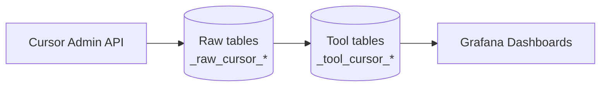

<!--
Licensed to the Apache Software Foundation (ASF) under one or more
contributor license agreements.  See the NOTICE file distributed with
this work for additional information regarding copyright ownership.
The ASF licenses this file to You under the Apache License, Version 2.0
(the "License"); you may not use this file except in compliance with
the License.  You may obtain a copy of the License at

    http://www.apache.org/licenses/LICENSE-2.0

Unless required by applicable law or agreed to in writing, software
distributed under the License is distributed on an "AS IS" BASIS,
WITHOUT WARRANTIES OR CONDITIONS OF ANY KIND, either express or implied.
See the License for the specific language governing permissions and
limitations under the License.
-->
# Cursor Plugin (Usage & Cost)

This plugin ingests **Cursor team usage, billing, and adoption metrics** from the [Cursor Admin API](https://cursor.com/docs/account/teams/admin-api) and stores them in DevLake tool-layer tables for Grafana dashboards and SQL analysis.

It follows the same structure and patterns as other DevLake AI usage plugins (notably `backend/plugins/gh-copilot`).

## What it collects

**Cursor Admin API endpoints:**

| Endpoint | Method | Data |
|----------|--------|------|
| `/teams/members` | GET | Team roster |
| `/teams/spend` | POST | Per-user billing cycle spend |
| `/teams/filtered-usage-events` | POST | Event-level usage and charges |
| `/teams/daily-usage-data` | POST | Per-user per-day adoption metrics |

**Cursor Enterprise API endpoints (Enterprise keys only -- skipped for Team keys):**

| Endpoint | Method | Data |
|----------|--------|------|
| `/analytics/ai-code/commits` | GET | Per-commit AI line attribution (TAB vs Composer vs non-AI) |
| `/analytics/ai-code/changes` | GET | Granular accepted AI changes with per-file metadata |
| `/analytics/team/conversation-insights` | GET | Aggregate conversation work classifications (intents, categories, complexity) |

**Stored data (tool layer):**

| Table | Description |
|-------|-------------|
| `_tool_cursor_members` | Team member roster (email, name, role) |
| `_tool_cursor_usage_events` | Billable usage events with model, tokens, and charged amounts |
| `_tool_cursor_user_spend` | Per-user spend for the current billing cycle (on-demand and included) |
| `_tool_cursor_daily_usage` | Daily adoption metrics: completions, requests by feature, tab acceptance, line edits |
| `_tool_cursor_ai_code_commits` | Per-commit AI line attribution: TAB, Composer, and non-AI lines (Enterprise only) |
| `_tool_cursor_ai_code_changes` | Accepted AI changes with source, model, and per-file metadata (Enterprise only) |
| `_tool_cursor_conversation_insights` | Flattened Conversation Insights metrics: intents, categories, complexity, guidance, work types (Enterprise only) |

Data is collected in the **Raw → Tool** layers only. There is no domain-layer converter in this plugin; Grafana dashboards query `_tool_cursor_*` tables directly.

## Data flow



**Pipeline subtasks (in order):**

1. `collectMembers` → `extractMembers`
2. `collectUsageEvents` → `extractUsageEvents`
3. `collectUserSpend` → `extractUserSpend`
4. `collectDailyUsage` → `extractDailyUsage`
5. `collectAiCodeCommits` → `extractAiCodeCommits` *(Enterprise only -- skipped for Team keys)*
6. `collectAiCodeChanges` → `extractAiCodeChanges` *(Enterprise only -- skipped for Team keys)*
7. `collectConversationInsights` → `extractConversationInsights` *(Enterprise only -- skipped when insights disabled or inaccessible)*

## Repository layout

- `api/` — REST layer for connections, scopes, and scope configs
- `impl/` — plugin meta, blueprint v200, connection helpers
- `models/` — tool-layer models and migration scripts
- `tasks/` — collectors, extractors, and pipeline registration
- `service/` — connection test logic (Admin API permission probes)
- `e2e/` — E2E fixtures and golden CSV assertions

## Setup

### Prerequisites

- A Cursor **Team or Business** plan with Admin API access
- A **Team Admin API key** from the Cursor dashboard (Dashboard → API Keys)
- Do **not** use a User API key from Settings → Integrations — user keys cannot access `/teams/*` endpoints

Authentication uses HTTP Basic auth: the API key as username with an empty password.

### 1) Create a connection

1. DevLake UI → **Connections → Add Connection → Cursor**
2. Fill in:
   - **Name**: e.g. `Cursor Production Team`
   - **Endpoint**: defaults to `https://api.cursor.com`
   - **Token**: Team Admin API key
   - **Rate Limit**: defaults to 1,200 requests/hour (Cursor documents 20 requests/minute)
3. Click **Test Connection**. DevLake probes `/teams/members`, `/teams/spend`, and `/teams/filtered-usage-events` and reports which endpoints the key can access.
4. Save the connection.

When updating an existing connection, omit the token field to keep the encrypted value already stored in DevLake.

### 2) Add a scope

Cursor data is team-level. Add a **Team** scope for the connection. The default scope ID is `team`.

### 3) Create a blueprint

Use a blueprint plan like:

```json
[
  [
    {
      "plugin": "cursor",
      "options": {
        "connectionId": 1,
        "scopeId": "team"
      }
    }
  ]
]
```

Run the blueprint on a daily schedule to keep usage and cost data current.

### Collection behavior

- **Initial backfill**: usage events and daily usage collect up to **90 days** of history on the first run.
- **Incremental runs**: subsequent runs use the pipeline sync policy / collector state (`LatestSuccessStart`) and **rewind 7 calendar days** so recently-missed or partial days are re-fetched (same idea as the gh-copilot report lookback).
- **Date range chunking**: both `/teams/daily-usage-data` and `/teams/filtered-usage-events` requests are split into **30-day** chunks (API limit for daily usage; applied to usage events for resilience).
- **Extract**: `extractUsageEvents` and `extractDailyUsage` use a cursor-local stateful extractor (incremental by default). Incremental runs also promote any raw rows with `id > MAX(_raw_data_id)` already in the tool table, so collected-but-unpromoted raw data is healed without a full refresh. A config version bump (`extractorVersion`) triggers a one-time full re-extract after upgrade.
- **Dashboards**: query `_tool_cursor_*` tables only. Legacy domain tables (`cursor_usage`, `cursor_team_events`) are unrelated and must not be used.
- **Rate limiting**: collectors honor `Retry-After` response headers and respect the configured `rateLimitPerHour`. The Admin API documents **20 requests/minute**; the connection default of **1,200/hour** (~20/min) matches that limit. Enterprise Analytics endpoints use separate quotas — **AI Code Tracking** (`/analytics/ai-code/*`) is **20 requests/minute**; team-level analytics (`/analytics/team/*`) is **100 requests/minute**. If enterprise collection triggers throttling, lower `rateLimitPerHour` on the connection.

## Dashboards

Grafana dashboard JSON lives under `grafana/dashboards/mysql/`:

| Dashboard | File | UID |
|-----------|------|-----|
| Cursor Usage & Cost | `cursor-usage.json` | `cursor_usage` |
| Cursor BugBot Review Analytics | `cursor-bugbot.json` | `cursor_bugbot` |
| AI Cost Efficiency (Cursor panels) | `ai-cost-efficiency.json` | — |
| Multi-AI Comparison (Cursor panels) | `multi-ai-comparison.json` | — |

## Error handling

| Symptom | Likely cause |
|---------|--------------|
| **401 Unauthorized** on test connection | Invalid API key, or a User API key instead of a Team Admin key |
| **403 Forbidden** on spend or usage events | Key lacks permission for that Admin API endpoint |
| **429 Too Many Requests** | Rate limit exceeded — lower `rateLimitPerHour` or wait for `Retry-After` |
| Empty usage events after successful run | Selected time range has no billable events, or sync policy excludes the date range |
| Tool max date stuck while raw advances | Deploy plugin with lookback + extract repair, then full-refresh the blueprint; verify `MAX(_raw_data_id)` in `_tool_cursor_*` catches up to `MAX(id)` in `_raw_cursor_*` |
| Reconciliation delta on dashboard | Expected when comparing event-level charges to billing-cycle spend snapshots; see dashboard notes |

Tokens are sanitized before persisting. Connection test results include a `permissions` object showing which Admin API endpoints succeeded.

## Enterprise AI Code Tracking

The following endpoints from the [AI Code Tracking API](https://cursor.com/docs/account/teams/ai-code-tracking-api) are **Enterprise plan only** and are collected when the connection uses an Enterprise Admin API key:

| Endpoint | Purpose | Tool table |
|----------|---------|------------|
| `GET /analytics/ai-code/commits` | Per-commit AI line attribution (TAB vs Composer vs non-AI) | `_tool_cursor_ai_code_commits` |
| `GET /analytics/ai-code/changes` | Granular accepted AI changes | `_tool_cursor_ai_code_changes` |

Team/Business Admin API keys receive **401** on these routes. `TestConnection` probes `/analytics/team/dau`, `/analytics/ai-code/commits`, and `/analytics/team/conversation-insights` to detect Enterprise access. The detected `KeyTier` (`personal`, `team`, or `enterprise`) is stored on the connection when you create, update the token, or test an existing connection. Enterprise collectors check `KeyTier` at runtime and skip silently for non-enterprise keys. Conversation Insights collectors also require `hasConversationInsights` on the connection (false when insights are disabled in Cursor team settings).

## Conversation Insights

The following endpoint from the [Analytics API](https://cursor.com/docs/account/teams/analytics-api) is **Enterprise plan only** and is collected when the connection uses an Enterprise Admin API key with Conversation Insights enabled:

| Endpoint | Purpose | Tool table |
|----------|---------|------------|
| `GET /analytics/team/conversation-insights` | Aggregate work classifications (intents, complexity, categories, guidance levels, work types) | `_tool_cursor_conversation_insights` |

Returns **aggregate** insights only — no raw conversation content or conversation IDs. Collectors request all five `include` slices per date chunk. Re-run **Test Connection** after enabling insights in Cursor so DevLake sets `hasConversationInsights`.

## BugBot Review Analytics

The following endpoint from the [BugBot Analytics API](https://cursor.com/docs/bugbot) is collected when `TestConnection` confirms access via `GET /analytics/team/bugbot-reviews`:

| Endpoint | Purpose | Tool tables |
|----------|---------|-------------|
| `GET /analytics/team/bugbot-reviews` | Completed BugBot reviews with findings, cost, and resolution status | `_tool_cursor_bugbot_reviews`, `_tool_cursor_bugbot_findings` |

Access is probed during connection test and persisted as `hasBugbotReviews` on the connection (may be available on Team or Enterprise keys). Collectors skip silently when the flag is false.

**Not yet collected:**

| Endpoint | Purpose |
|----------|---------|
| `GET /analytics/ai-code/commits.csv` / `changes.csv` | Bulk CSV exports (not needed; JSON pagination covers the same data) |
| `GET /analytics/team/agent-edits` | Agent edit metrics (suggested vs accepted diffs) |
| `GET /analytics/team/tabs` | Tab suggestion/accept/reject with line counts |
| `GET /analytics/team/dau` | CLI/Cloud/BugBot DAU breakdown |
| `GET /analytics/team/models` | Model usage by message count per day |
| `GET /analytics/by-user/*` | Per-user breakdowns of the above |

## Limitations

- **Enterprise API endpoints are conditional** — AI Code Tracking (`/analytics/ai-code/*`) is collected only with Enterprise Admin keys. Conversation Insights runs when `hasConversationInsights` is true. BugBot review analytics (`/analytics/team/bugbot-reviews`) runs when `hasBugbotReviews` is true on the connection. Other Analytics endpoints (`/analytics/team/*`) are not yet collected (see sections above).
- **Tool layer only** — no domain-layer tables; cross-plugin joins (Jira, GitHub PRs, etc.) are done in Grafana SQL or separate tooling.
- **Team-level scope** — one scope per connection represents the whole team; per-team multi-tenant collection is not supported.
- **Beta** — the plugin is marked beta in Config UI while the Admin API surface continues to evolve.

## Testing

```sh
# Unit tests
cd backend && go test ./plugins/cursor/...

# E2E (requires E2E_DB_URL)
make e2e-test
```

E2E fixtures live in `backend/plugins/cursor/e2e/raw_tables/` and `e2e/snapshot_tables/`.
